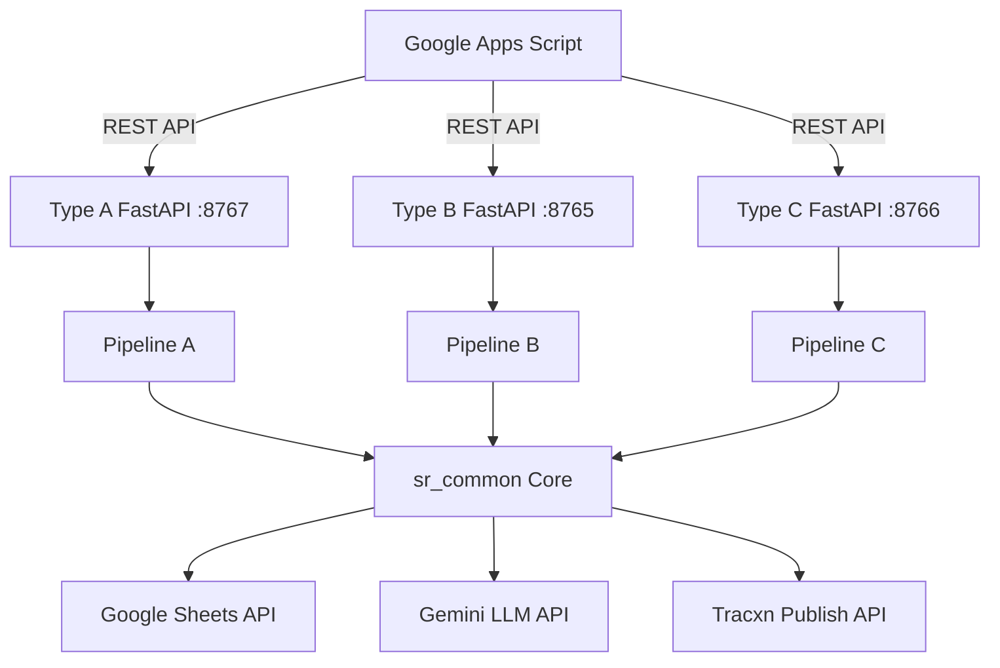

# SR Publishing Engine

> **High-performance, Python-native automation suite designed to stabilize and scale the Tracxn publishing pipeline.**

## Executive Summary

The SR Publishing Engine is a robust, multi-tier orchestration system that automates the discovery, extraction, classification, and Tracxn platform integration of domain data. It manages three distinct processing pipelines (Type A, B, and C) through a unified `uv`-driven environment. The system leverages LLMs (Google Gemini) for classification and a multi-layered stealth scraping architecture to bypass aggressive bot-mitigation techniques.

## Architecture Overview

The system follows a modular, domain-driven design, strictly decoupling the underlying fetching/stealth logic from the API orchestration.

- **Orchestration Layer**: FastAPI-driven workers handle job state, concurrency locking (`asyncio.Lock`), and Google Apps Script integration.
- **Core Processing (`sr_common`)**: Centralizes the logic for rate-limiting, Google Sheets API batching, and stealth browser lifecycle management.
- **Dependency Management**: Powered exclusively by `uv`, utilizing a centralized `pyproject.toml` to guarantee deterministic builds across Ubuntu and macOS.



## Core Components

| Component | Description | Port |
| :--- | :--- | :--- |
| **Type A (High-Fidelity)** | Deep multi-page scraping, dual-level BM prediction, and Special Flag extraction. | `8767` |
| **Type B (Scale)** | High-concurrency throughput with dynamic resource scaling and proxy fallback. | `8765` |
| **Type C (Operations)** | Dynamic sheet processing, fuzzy header detection, and automated data cleanup. | `8766` |
| **sr_common** | Centralized stealth Fetcher, config via Pydantic V2 `BaseSettings`, and Tracxn/Gemini clients. | N/A |

## Setup & Installation

### 1. Prerequisites
- **Python 3.10+** (3.12+ recommended)
- **Git**, **Screen**, **lsof** (Linux/macOS)
- **Cloudflared** (For tunnel connectivity)

### 2. Environment Configuration
Create a `.env` file in the root directory:
```bash
GEMINI_API_KEY="your-gemini-key"
SERVICE_AUTH_TOKEN="your-secure-token"
# Optional overrides:
CONFIGURED_MAX_WORKERS=10
```

### 3. Initialize Workspace
We utilize the ultra-fast `uv` package manager for isolated environments. Run the centralized control script:
```bash
./control.sh
```
*Select **Option 1 (Init Workspace)**. This will automatically sync dependencies via `uv sync` and fetch browser binaries.*

## API Documentation (Endpoints)

All engine APIs require Bearer token authentication matching the `SERVICE_AUTH_TOKEN`.

### `POST /{type}/start`
Initiates a background execution pipeline.
- **Security**: Bearer Token
- **Payload (`RunRequest`)**:
  ```json
  {
    "start_row": 2,
    "mode": "full",
    "sheet_id": "optional_google_sheet_id"
  }
  ```
- **Response**: `{"status": "accepted"}`

### `GET /{type}/status`
Retrieves the real-time execution status of the pipeline.
- **Security**: Bearer Token
- **Response**:
  ```json
  {
    "status": "running",
    "active": true,
    "progress_current": 45,
    "progress_total": 100,
    "progress_success": 40,
    "progress_fail": 5,
    "workerName": "Node-TypeA-Pipeline"
  }
  ```

### `POST /{type}/cancel`
Gracefully terminates the active background process by emitting SIGKILL to the locked PID.
- **Security**: Bearer Token
- **Response**: `{"status": "ok"}`

## Operational Guide

### Execution Modes
1. **Full Run**: End-to-end execution (Scrape -> LLM Predict -> Tracxn API Publish).
2. **Phase 1 Only**: Performs Scrape & LLM predictions only. Stages data in Google Sheets for review.
3. **Phase 2 Only**: Skips scraping. Reads approved Phase 1 data from Sheets and pushes to Tracxn APIs.

### Advanced Stealth Architecture (v6.8+)
The `sr_common/fetcher.py` module integrates a 4-tier cascading fallback system to evade bot mitigation:
1. **Tier 0 (Standard)**: Asynchronous HTTPX requests.
2. **Tier 1 (Impersonation)**: `curl-cffi` mimicking Chrome TLS/HTTP2 fingerprints.
3. **Tier 2 (Headless Browser)**: `Camoufox` with non-linear Bézier cursor movements.
4. **Tier 3 (Stealth Scrapling)**: Hardened async Scrapling context.

### Resource & Health Monitoring
The engines utilize a `SystemHealthMonitor` to dynamically scale max concurrent workers based on logical cores and available memory. If CPU exceeds 90%, workers will temporarily pause extraction.

## Security Model

- **Memory Protection**: FastAPI middleware securely handles incoming request streams without buffering payloads into memory, preventing DoS (Denial of Service) via OOM.
- **API Authentication**: Endpoint access is strictly gated behind the local `SERVICE_AUTH_TOKEN`.
- **Process Isolation**: Every pipeline executes inside an isolated `subprocess.exec` sandbox spawned by the FastAPI worker, ensuring that script crashes do not bring down the orchestration server.

## Troubleshooting

- **Logs Location**:
  - `control.logs`: Orchestration and CLI events.
  - `Type*/Logs/api.logs`: HTTP request and lifecycle events.
  - `Type*/Logs/Type*Publishing.log`: Granular engine and scraping output.
- **Zombie Processes**: Run `./control.sh` -> **Option 3 (Deep Clean)** to locate and destroy detached python or uvicorn processes locking up system ports.
